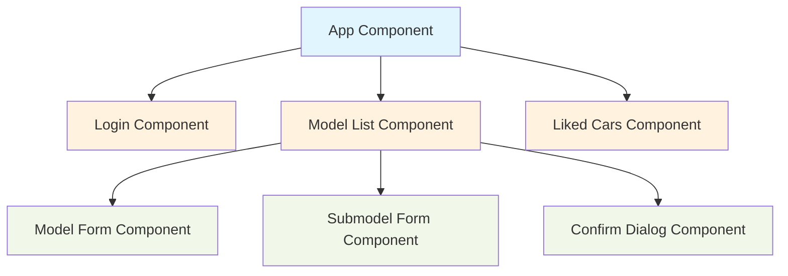
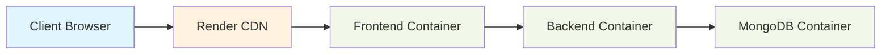

# BMW E-Chassis Application - Project Report

## Introduction
The BMW E-Chassis Application is a modern web platform designed to catalog and manage BMW car models and their specifications. The application features a robust authentication system, role-based access control, and comprehensive car model management capabilities. Key features include:

- Secure JWT-based authentication with user roles (admin/regular)
- Detailed car model and submodel management system
- Interactive "like" functionality for users to save favorite models
- Comprehensive technical specifications for each model
- Mobile-responsive design using Angular Material
- State management using Angular Signals
- Containerized deployment with Docker

The application has evolved from a basic CRUD system to a feature-rich platform with enhanced data models, improved user experience, and robust security measures.

## Background - Schema Development
The schema has undergone significant evolution throughout the implementation:

### Initial Schema:
- Basic car model information (name, year, description)
- Simple submodel details (engine, horsepower, transmission)
- Basic user model with authentication fields

### Enhanced Schema:
1. Car Model Implementation:
   - Basic model information (name, year introduced/discontinued, description)
   - Detailed submodel specifications:
     * Engine type and performance (horsepower, torque)
     * Transmission details
     * Year of manufacture
     * Image support
   - Schema supports additional fields but not currently exposed in UI:
     * Technical specifications (weight, dimensions)
     * Performance metrics (acceleration, top speed)
     * Fuel economy data

2. User Model Features:
   - Role-based access control (admin/user roles)
   - Liked models tracking with model/submodel references
   - Timestamp tracking (createdAt, updatedAt)
   - Enhanced validation:
     * Email format validation
     * Minimum password length (8 characters)
     * Role validation
     * Liked models structure validation

The schema evolution was driven by the need to provide more comprehensive information about each model while maintaining data integrity and validation.

## Components


### Key Components:
- App Component: Main application shell with navigation
- Login Component: Handles user authentication
- Model List Component: Displays and manages car models
- Liked Cars Component: Shows user's favorite models
- Model/Submodel Forms: Handles data entry and editing
- Confirm Dialog: Reusable confirmation modal

## Architecture


The application uses a containerized microservices architecture:
- Frontend: Angular application served through Render's CDN
- Backend: Express.js API in a Docker container
- Database: MongoDB instance in a separate container
- All services are orchestrated using Docker Compose
- CI/CD pipeline using GitHub Actions for automated deployment

## Implementation vs Proposal
Most proposed features were successfully implemented with some modifications:

### Achieved as Proposed:
- JWT authentication and role-based access
- Model/submodel management system
- User likes functionality
- Mobile responsive design
- Docker containerization

### Modified Implementations:
1. Cloud Platform:
   - Proposed: AWS deployment
   - Actual: Render deployment (simpler setup, cost-effective)

2. Image Gallery:
   - Proposed: Dedicated image gallery
   - Actual: Basic image support (marked as "Could Have" in MoSCoW)

3. Additional Features:
   - Added: Comprehensive validation for all data inputs
   - Added: Image URL support for models
   - Added: Enhanced user role management

## Reflection

### What Went Well:
- Successful implementation of core features
- Effective use of Angular Material for UI
- Strong authentication system
- Comprehensive data model
- Good mobile responsiveness

### Challenges:
- Initial learning curve with Angular Signals
- Balancing feature scope with time constraints
- Managing state across components effectively

### Future Improvements:
- Implement comprehensive image management
- Add real-time data updates
- Enhance test coverage
- Add performance monitoring
- Implement user profiles

## Appendix 1 - Special Instructions

### Local Development:
1. Clone repository
2. Create .env file with:
   ```
   MONGO_USERNAME=your_username
   MONGO_PASSWORD=your_password
   JWT_SECRET=your_jwt_secret
   ```
3. Run `docker-compose up -d`
4. Access at http://localhost

### Demo Credentials:
- Admin: jarla1335@gmail.com / QdKiw65r5y32MUZ
- User: kevindebruyne@atusligo.com / Nc3n46DbyeFDDhH

## Appendix 2 - Screenshots
1. Model List View

2. Model Details

3. Liked Cars

4. Mobile View

## Appendix 3 - Testing
The project includes several types of tests:

### Backend Tests:
- Unit tests for user likes functionality (user-likes.test.ts)
- API endpoint tests using HTTP request files (carmodels.http)
- Schema validation tests in models

### Frontend Tests:
- Component tests (.spec.ts files for components)
- Service tests (auth-custom.service.spec.ts, model.service.spec.ts)
- Integration tests for key features

### Key Test Files:
- bmw-api/src/tests/user-likes.test.ts
- bmw-api/src/tests/carmodels.http
- BmwApiPt2/src/app/services/submodel.service.spec.ts
- BmwApiPt2/src/app/components/model-form/model-form.component.spec.ts

### Testing Strategy:
- Authentication flows
- CRUD operations for models/submodels
- User interactions (likes system)
- Form validation
- Error handling

## Appendix 4 - Original Proposal


## Additional Notes

### Enhanced Features Not in Original Proposal:
- Comprehensive form validation with detailed error messages
- Timestamp tracking for data auditing
- Enhanced user role management with granular permissions
- Modular component architecture for better maintainability

### Future Considerations:
- Implement additional car details supported by the schema
- Add real-time updates using WebSockets
- Enhance search and filtering capabilities
- Add analytics for user interactions
- Implement comprehensive image management system

